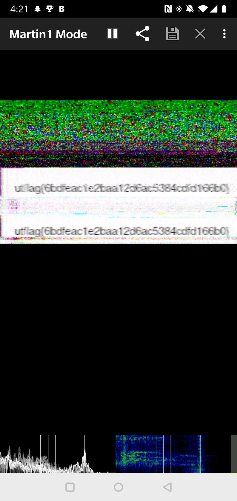

# UTCTF

Write up for the UTCTF 2020 Forensics Challenges

## Basics
>My friend said they hid a flag in this picture, but it's broken! Now that I think about it, I don't even know if it really is a picture...

Running the command _file_ we can see that the given jpg is actually a text file. Running the command _cat secret.jpeg | grep "utflag"_ gives us the flag.

> utflag{fil3_ext3nsi0ns_4r3nt_r34l}

## Spectre
> I found this audio file, but I don't think it's any song I've ever heard... Maybe there's something else inside?

The title of the challenge implies that we have to look at the spectrum of the given audio file.
The spectrum of the signal means the spectrum of frequencies of the audio file. Opening the file in Audacity and viewing the spectogram we obtain the flag.

## 1 Frame per minute
> I recently received this signal transmission known as SSTV in a mode called Martian? This technology is all very old so I'm not sure what to do with it. Could you help me out?

We are given a wav file which is actually a SSTV transmission. Using a SSTV application and setting the mode to Martian we obtain the flag.

## The Legend of Hackerman Pt 1
We are given a corrupted png file. Opening this file in a hex editor we can see that the magic number is not correct. We replaced the first couple of bytes with 89 50 4E 47 and then opened the file to find the flag.

## The Legend of the Hackerman Pt 2
> Ok, I've received another file from Hackerman, but it's just a Word Document? He said that he attached a picture of the flag, but I can't find it...

## Observe Closely
Running binwalk on the given image, we see that there is a hidden binary. We extracted it using _binwalk -e_ and we ran the file to obtain the flag.

> utflag{2fbe9adc2ad89c71da48cabe90a121c0}

